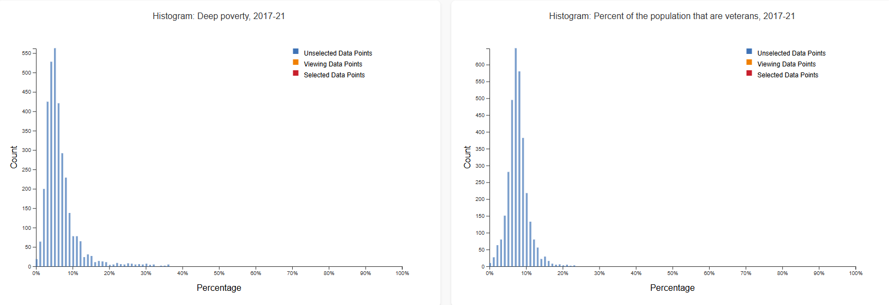
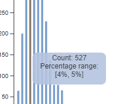
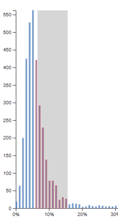
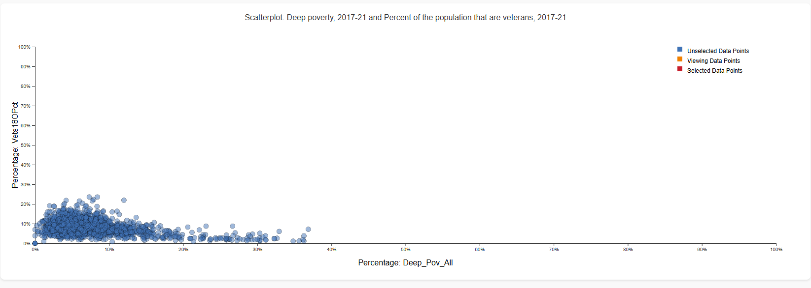
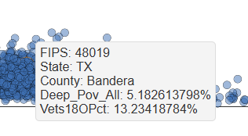
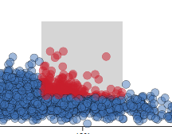
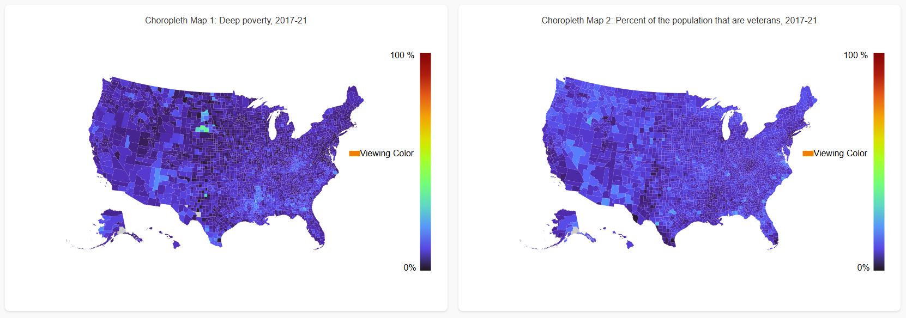
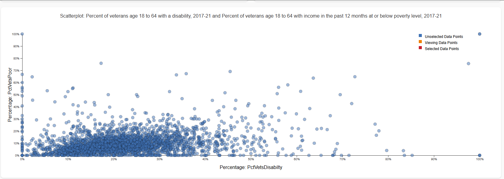

# Visual_Interfaces_Project_1

Link to hosted project: https://nsuer.github.io/Visual_Interfaces_Project_1/

Link to github repository: https://github.com/NSuer/Visual_Interfaces_Project_1

## Motivation
In this project I want to help a general audience understand socio-economic data points about US counties. The theme for my project is "Exploring economy and how they impact military service and verterans". I wanted to do this project because I am related to many veterans and I wanted to understand how their service has impacted their lives and the lives of those around them. I also wanted to understand how the economy of the area they live in has impacted their lives and if it impacted their decision to join the military.

This project is important because it helps us understand the impact of the economy on the lives of veterans and how it impacts their decision to join the military. It also helps us understand how the economy of the area they live in impacts their lives and the lives of those around them. This project can help us understand the socio-economic factors that impact the lives of veterans and how we can help them.

## Data
The data I used for this project is from the USDA atlas of rural and small-town America. The data includes socio-economic data points about US counties. The data includes information about the economy, population, and military service of US counties. For my project, I used data about the economy and military service of US counties. I preprocessed the data by removing all data points that were not relevant to my project. I also made a "magic number" row (value -1) so that I could include descriptions of the data points in my visualization.
Links for the original data and my preprocessed data are below:

Original data: https://www.ers.usda.gov/data-products/atlas-of-rural-and-small-town-america

Preprocessed data: https://github.com/NSuer/Visual_Interfaces_Project_1/blob/main/MyData.xlsx

## Sketches
I did not do any sketches for this project. I went straight to coding. I did this because I had a clear idea of what I wanted to do and I wanted to see if I could do it. The directions for this project also stated that sketching was optional.

## Visualization Components
The main views of my data are 2 bar charts, a scatterplot, and 2 chloropleth maps. I will go through each view and explain what they show and how they work. 

### Bar Charts
The bar charts show the main data points of the project. The x-axis is the data point , it is labeled percenatge because all of my data are percenatges of the population. The y-axis is the number of counties that have that value for the data point. You can interact with the bar charts by hovering over the bars. When you hover over the bars, a tooltip will appear that shows the range of values for that bar and the number of counties that have that value. You can also interact with the bar charts with a brush, to use the brush you click and drag on the bar chart. When you use the brush, the scatterplot and chloropleth maps will highlight the counties that are within the range of the brush.

Image of components:

Image of tooltip:

Image of brush:

### Scatterplot
The scatterplot shows the relationship between two data points. The x-axis is the first data point and the y-axis is the second data point. You can interact with the scatterplot by hovering over the points. When you hover over the points, a tooltip will appear that shows the values of the data points for that county. You can also interact with the scatterplot with a brush, to use the brush you click and drag on the scatterplot. When you use the brush, the bar charts and chloropleth maps will highlight the counties that are within the range of the brush.

Image of components:

Image of tooltip:

Image of brush:

### Chloropleth Maps
The chloropleth maps show the data points on a map of the US. The first map shows the data points for the first data point and the second map shows the data points for the second data point. You can interact with the chloropleth maps by hovering over the counties. When you hover over the counties, a tooltip will appear that shows the values of the data points for that county. 

Image of components:

Image of tooltip:

## What the application allows you to discover
The application allows you to discover the relationship between the economy and military service of US counties. You can see how the economy of a county impacts the military service of that county. One observation I made was that it seems like there might be a correlation between veterans on disability and poverty of veterans. Here is an image of the scatterplot that shows this relationship:

## Process
<!-- 1 section on your process- what libraries did you use?  How did you structure your code?  How can you access it and run it?  Link to your code (and the live application, if it is deployed online).  -->

### Libraries
I only used D3 on the project

### Code Structure
My code is structured in a fairly normal wy, with each graph being it's own file. The only things of note are my use of a variable called "window.selectedCounties" which is a variable that is stored in the window so that all of the graphs can access it. This variable is an array of the counties that are selected by the brush. I have an event listener that is triggered whenever I change the selected counties. This event listener then updates the other graphs to show the selected counties. 

## Challenges and Future Work

## AI and Collaboration
- I use github copilot when I program. This is used more as an autocomplete tool than anything.
- I used google to learn how to do the cloropleth map. I lost the link though. The code is mostly my own though.

## Demo

